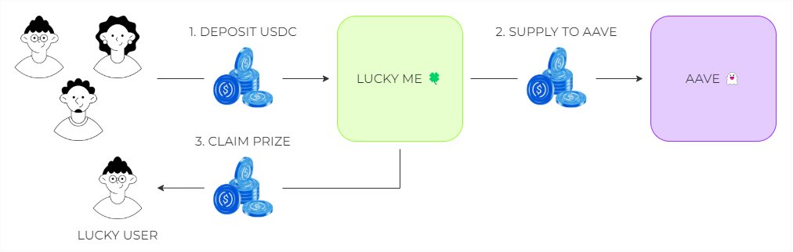
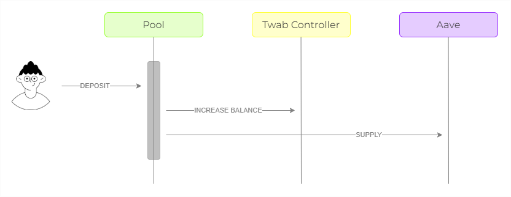
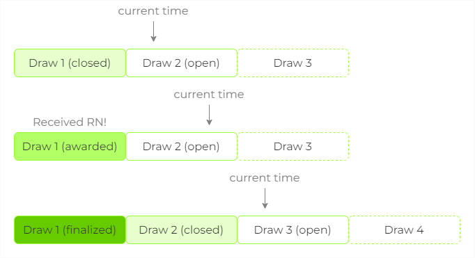

# Lucky Me 🍀

Lucky Me is a simplified version of PoolTogether, i.e. a decentralized, risk-free lottery where users deposit USDC to become eligible for weekly prizes.

Essentially, the system works by supplying all the USDC deposited in Lucky Me to Aave in order to generate yield. This means that every time a user deposits USDC into Lucky Me, these tokens are immediately sent to Aave. The generated yield is then used to award lucky users with prizes every week.



> ⚠️ **IMPORTANT** ⚠️
>
> This project has been developed for educational purposes only and has not been audited.
> 
> Please do not use it in production!

## Deposits

As previously said, whenever users deposit into Lucky Pool they are really deposit into Aave. In order for users to be eligible to win prizes, their balances are tracked in the Twab Controller.



The Twab Controller is the system module responsible for tracking users' balances, so that the protocol can determine how much liquidity they held between two timestamps. "Twab" stands for time-weighted average balance, which is the algorithm used to track balances.

Every time a user deposits into Lucky Me, the Twab algorithm adds a new observation to a ring buffer of observations for that user, allowing the computation of the user's average balance between two timestamps. A Twab observation includes:

- Timestamp: the current timestamp.
- Balance: the current balance.
- Cumulative Balance: the cumulative twab

The cumulative balance is computed using the formula: 

`cumulativeBalance = lastCumulativeBalance + lastBalance * (timestamp - lastTimestamp)`

Then we can calculate the average balance held between two observations by computing:

`averageBalance = (endCumulativeBalance - startCumulativeBalance) / (endTimestamp - startTimestamp)`

## Draws

Draws are like numbered timeframes, having a duration of 1 week each. The Pool is initialized with the first draw start time. Draw 1 is the first period of time, Draw 2 is the second period of time, etc. Each draw goes through a lifecycle of states:

- **Open**: the open draw is the one that is currently receiving contributions. It is the next draw to close.
- **Closed**: once the draw end has elapsed, the draw is considered closed. It will no longer receive new contributions.
- **Awarded**: when the random number is submitted from Chainlink, the most recent closed draw becomes awarded and prizes can be claimed.
- **Finalized**: draws become finalized after one draw period has elapsed after they close. After this time no prizes can be claimed for that draw.



## Winner Eligibility

Users are eligible to claim the prize if their pseudo-random number (PRN), a unique number per draw and user, is within a certain range. There are three steps in this process:

1. Compute the pseudo-random number.
2. Compute the winning zone.
3. Check if the PRN is below the winning zone.

First, we compute the pseudo-random number by hashing, with keccak256, the abi-encoded params:

```solidity
uint256 userPRN = uint256(keccak256(abi.encode(_drawId, drawRandomNumber, _user)));
```

Next, we compute the winning zone by multiplying the user's time-weighted average balance with a lucky factor, which is a scale factor:

```solidity
uint256 winningZone = (userTwab * luckFactor) / ONE_HUNDRED_PERCENT_BPS;
```

Finally, we check if the user's PRN is below the winning zone:

```solidity
bool userWon = userPRN % poolTwab < winningZone;
```

> **Note**: The above formula is simplified, as modulo bias is properly handled.

## Build & Test Instructions

First, install the project dependencies:

```bash
forge install
```

Next, compile the project files:

```bash
forge build
```

After, create a `.env` file with the following params:

```text
MAINNET_RPC_URL="MAINNET_RPC_URL"
```

Finally, run the tests:

```bash
forge test
```
